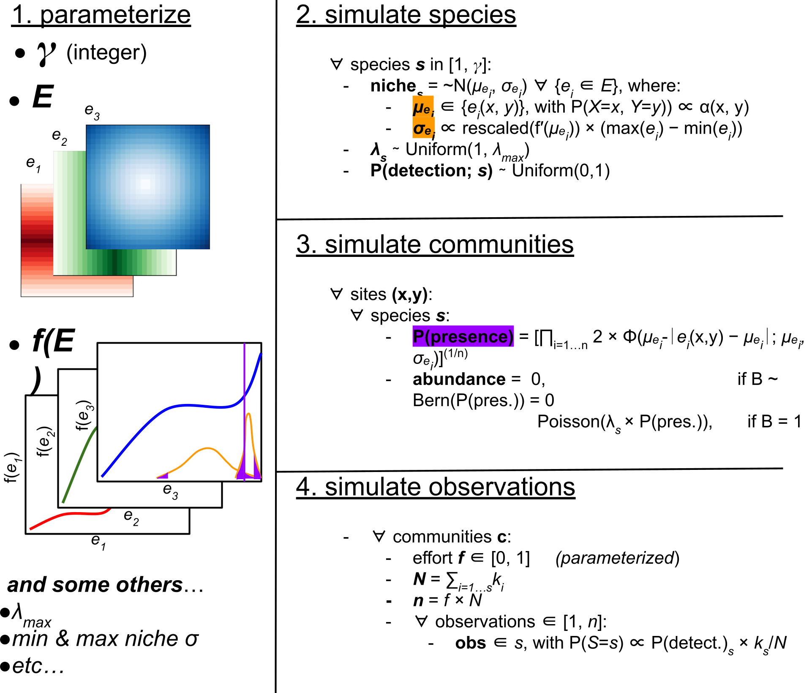

# SOBiG!

### **S**imulation of **O**bservations of **Bi**odiversity across **G**radients

A Python package for 'reverse-engineering' generalised dissimilarity modelling (GDM)
to simulate communities distributed across variable landscapes,
and then using a 'virtual ecologist' to simulate various observation processes on those communities.



## Overview

This package is designed for methods development in community ecology and biodiversity
modelling. It 'reverse-engineers' generalised dissimilarity modelling (GDM), allowing
the user to define environmental landscapes, monotonic environmental
turnover functions (e.g. I-splines) that relate ecological community turnover to those landscapes' variables, the size of the regional species pool (i.e., gamma diversity), and the set of sampling locations. Then it simulates communities at all sampling locations and 
uses a 'virtual ecologist' approach to simulate various observation processes on those communities
(ranging from full-communtiy censuses, to abudance-absence, presence-absence, or presence-only (i.e., 'opportunistic') records.

Workflows can be built from the following steps:

1. Define a landscape and environmental turnover functions.
2. Simulate the latent communities.
3. Simulate one or more observation/survey processes.
4. Fit/visualize GDM or other biodiversity models to the simulated data.
5. Modify environmental layers to represent environmental change.
6. Re-simulate communities and observations.

See the documentation for the full API and examples.

## Installation

```bash
pip install sobig
```

## License

See `LICENSE`.
